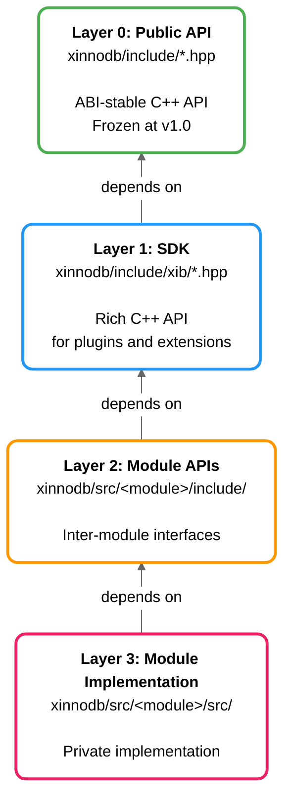
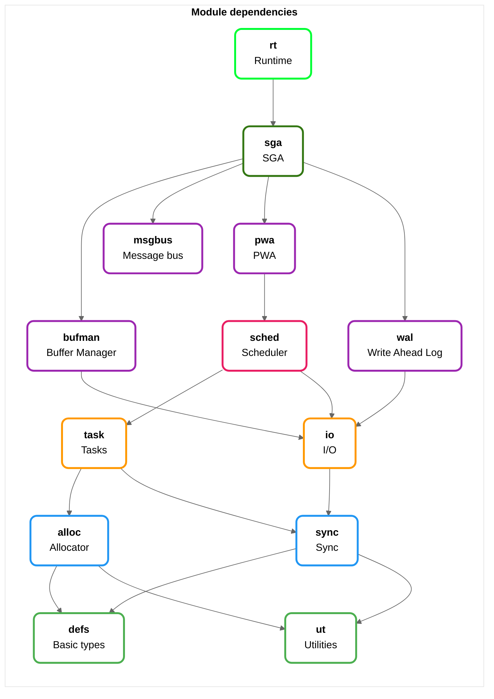

# Contributing (WIP not finalized)

## Physical Architecture

### Overview

XInnoDB follows a strict layered architecture designed for ABI stability, maintainability, and extensibility.
The system is organized into distinct layers with clear dependency rules and no circular dependencies.

## Architecture Layers

<!-- markdownlint-disable MD033 -->
<div style="background-color: #ffffff; padding: 20px; border: 1px solid #e0e0e0; border-radius: 8px;">



</div>
<!-- markdownlint-enable MD033 -->

**Layer Hierarchy (Bottom to Top):**

- **Layer 0**: Public API - What users see and use (stable, foundation)
- **Layer 1**: SDK - Rich extension layer for developers (less stable)
- **Layer 2**: Module APIs - Inter-module interfaces  
- **Layer 3**: Module Implementation - Private implementation details

## Directory Structure

```text
xinnodb/
├── include/                             # Layers 0: Public Stable API
│   └── ib/                              # Layers 0: SDK subdirectory
│
└── src/                                 # Layers 2 & 3: Module APIs and Implementation
    ├── defs/                            # Foundation - Basic definitions
    │   ├── include/defs/                #   Layer 2: Module public API
    │   ├── src/                         #   Layer 3: Private implementation
    │   └── test/                        #   Layer 3: Unit tests
    │
    ├── ut/                              # Foundation - Utilities
    │   ├── include/ut/                  #   Layer 2: Module public API
    │   ├── src/                         #   Layer 3: Private implementation
    │   └── test/                        #   Layer 3: Unit tests
    │
    ├── alloc/                           # Core - Memory allocator
    │   ├── include/alloc/               #   Layer 2: Module public API
    │   ├── src/                         #   Layer 3: Private implementation
    │   └── test/                        #   Layer 3: Unit tests
    │
    ├── sync/                            # Core - Synchronization
    │   ├── include/sync/                #   Layer 2: Module public API
    │   ├── src/                         #   Layer 3: Private implementation
    │   └── test/                        #   Layer 3: Unit tests
    │
    ├── io/                              # Core - I/O operations
    │   ├── include/io/                  #   Layer 2: Module public API
    │   ├── src/                         #   Layer 3: Private implementation
    │   └── test/                        #   Layer 3: Unit tests
    │
    ├── task/                            # Runtime - Coroutine tasks
    │   ├── include/task/                #   Layer 2: Module public API
    │   ├── src/                         #   Layer 3: Private implementation
    │   └── test/                        #   Layer 3: Unit tests
    │
    ├── sched/                           # Runtime - Scheduler
    │   ├── include/sched/               #   Layer 2: Module public API
    │   ├── src/                         #   Layer 3: Private implementation
    │   └── test/                        #   Layer 3: Unit tests
    │
    ├── pwa/                             # Runtime - Private Worker Area
    │   ├── include/pwa/                 #   Layer 2: Module public API
    │   ├── src/                         #   Layer 3: Private implementation
    │   └── test/                        #   Layer 3: Unit tests
    │
    ├── sga/                             # System - Shared Global Area
    │   ├── include/sga/                 #   Layer 2: Module public API
    │   ├── src/                         #   Layer 3: Private implementation
    │   └── test/                        #   Layer 3: Unit tests
    │
    ├── msgbus/                          # System - Message bus
    │   ├── include/msgbus/              #   Layer 2: Module public API
    │   ├── src/                         #   Layer 3: Private implementation
    │   └── test/                        #   Layer 3: Unit tests
    │
    └── rt/                              # System - Runtime orchestration
        ├── include/rt/                  #   Layer 2: Module public API
        ├── src/                         #   Layer 3: Private implementation
        └── test/                        #   Layer 3: Unit tests
```

## Layer 0: Public API (`xinnodb.hpp`)

### Purpose

The public API is the **forever-stable** interface for all XInnoDB users. It uses type erasure to achieve ABI stability while supporting C++20 coroutines.

### Design Principles

1. **Type Erasure**: All templates are wrappers around type-erased functions
2. **POD Types**: All handle types are Plain Old Data (fixed size, no vtables)
3. **Stable Values**: Enum values never change once published
4. **Additive Only**: New functions/enums can be added, never removed
5. **No Breaking Changes**: After 1.0 release, API is frozen

### Structure

```cpp
// xinnodb.hpp has two sections:

// SECTION 1: Type-Erased API (Stable ABI)

// POD handle types
struct ib_sga_hdl { ib_u64 hdl; };

// Type-erased result container
struct ib_async_result {
    ib_async_opaque opaque;
    const ib_async_ops* ops;
    char result_buffer[32];
};

// Type-erased functions (exported from library)
ib_async_result ib_trx_commit_async(ib_trx_hdl) noexcept;


// SECTION 2: Template Wrappers (No ABI surface)

// Header-only template wrappers
template<typename T>
class ib_async_hdl { /* wraps ib_async_result */ };

// Convenience template functions
inline ib_async_hdl<ib_err> ib_trx_commit(ib_trx_hdl);

```

### Adding to Public API

**✅ ALLOWED:**

- Add new functions (additive)
- Add new enum values at the end
- Add new handle types
- Add overloads (carefully)

**❌ FORBIDDEN:**

- Change function signatures
- Remove functions
- Change enum values
- Change struct layouts
- Rename symbols

## Layer 1: SDK (`xinnodb/sdk/`)

Rich C++ API for plugin and extension developers. Built on top of the stable public API.

1. **Depends on Public API**: Includes `xinnodb.hpp`
2. **Modern C++**: RAII, exceptions, smart pointers, concepts
3. **Can Evolve**: Free to add/change features without breaking public API
4. **Plugin Friendly**: Virtual interfaces for extensibility

### Example Module: `xinnodb/sdk/database.hpp`

```cpp
#pragma once
#include "xinnodb.hpp"  // Depends on public API


class ib_db {
    ib_state_hdl handle_;
public:
    // RAII wrapper
    static ib_async_hdl<Database> create(ib_sga_hdl);
    
    // Rich interface
    auto begin_transaction() -> ib_async_hdl<Transaction>;
    
    // Access underlying handle
    ib_state_hdl native_handle() const noexcept;
};

```

### Versioning

SDK versions independently from public API:

- Public API: `v1.0.0` (frozen)
- SDK: `v1.5.2` (can evolve)

## Layer 2: Module APIs (`xinnodb/src/*/include/`)

Module APIs provide the public interface that each implementation module exposes to other modules. This is the inter-module communication layer.

1. **Interfaces**: Minimal, focused API for each module
2. **Type Safety**: Strong typing for inter-module communication
3. **No Circular Dependencies**: Enforced through dependency levels
4. **Documentation**: All APIs must be documented

### Example: Allocator Module API

```cpp
// xinnodb/src/alloc/include/alloc/alloc.hpp
#pragma once

#include "alloc/alloc_types.hpp"

    // Public API for other modules to use
    void* alloc_table_malloc(ib_alloc_table* table, size_t size) noexcept;
void  alloc_table_free(ib_alloc_table* table, void* ptr) noexcept;
int   alloc_table_init(ib_alloc_table* table, void* mem, size_t size) noexcept;
```

## Layer 3: Module Implementation (`xinnodb/src/*/src/`)

The module implementation layer contains all private implementation details, helper functions, and internal data structures. This is the "leaf" layer where actual work happens.

1. **Encapsulation**: Implementation details never leak to other modules
2. **Private Headers**: Internal headers in `src/` directory only
3. **No External Includes**: Other modules cannot include implementation files
4. **Freedom to Refactor**: Can change freely without affecting other modules

### Example: Allocator Module Implementation

```cpp
// xinnodb/src/alloc/src/alloc_impl.hpp (PRIVATE)
#pragma once

#include "alloc/alloc.hpp"

void* alloc_find_free_block(ib_alloc_table* table, size_t size) noexcept;
void  alloc_coalesce_blocks(ib_alloc_table* table) noexcept;
    
// Private data structures (no ib)
struct alloc_block {
    size_t size;
    alloc_block* next;
};

```

```cpp
// xinnodb/src/alloc/src/alloc_table.cpp (PRIVATE)
#include "alloc_impl.hpp"


void* alloc_malloc(ib_alloc_table* table, size_t size) noexcept {
    // Implementation uses private helpers
    // ...
    return alloc_find_free_block(table, size);
}

```

### Private Implementation Rules

1. **Header Location**: All private headers in `src/` subdirectory
2. **Include Guards**: Use `#pragma once`
3. **Documentation**: Document complex algorithms, not required for all helpers
4. **Testing**: Private details can be tested via white-box testing

## Module Structure Template

### Module Template

Each module follows this structure:

```text
xinnodb/src/<module>/
├── include/<module>/           # Layer 2: Module public API
│   ├── <module>.hpp            # Main module interface
│   └── <module>_types.hpp      # Public types
│
├── src/                        # Layer 3: Private implementation
│   ├── <module>_xxx.hpp        # Private headers
│   └── <module>_yyy.cpp        # Implementation files
│
└── test/                       # Unit tests
    └── test_<module>_what.cpp
```

### Include Guidelines

**From other modules:**

From module `A`:

```cpp
#include "<module B>/<module B>.hpp"  // ✅ Correct
```

From module `A`:

```cpp
#include "<module B>/src/xxx.hpp"  // ❌ WRONG - private header
```

## Dependencies

### Structural type relations

**todo**: write a type structural diagram

### Module Dependencies

<!-- markdownlint-disable MD033 -->
<div style="background-color: #ffffff; padding: 20px; border: 1px solid #e0e0e0; border-radius: 8px;">



</div>
<!-- markdownlint-enable MD033 -->

**Dependency Levels:**

**todo**: complete the dependencies

- 🟢 **Level 0** (Green): `defs`, `ut` - No dependencies
- 🔵 **Level 1** (Blue): `alloc`, `sync` - Depend on Level 0
- 🟠 **Level 2** (Orange): `io`, `task`, `sga` - Depend on Level 1
- 🔴 **Level 3** (Pink): `sched`, `pwa` - Depend on Level 2
- 🟣 **Level 4** (Purple): `msgbus`, `rt` - Depend on Level 3

### Dependency Rules

1. **Acyclic**: No circular dependencies allowed
2. **Explicit**: All dependencies documented in module `README.md`
3. **Minimal**: Depend only on what you need

### Checking Dependencies

```bash
# Generate dependency graph
./scripts/check-dependencies.sh

# Verify no cycles
./scripts/verify-acyclic.sh
```

## Adding a New Module

### Step 1: Create Module Structure

todo: replace with nix cmd

```bash
cd xinnodb/src
mkdir -p mymodule/{include/mymodule,src,test}
touch mymodule/include/mymodule/mymodule.hpp
touch mymodule/src/mymodule.cpp
touch mymodule/test/test_mymodule.cpp
touch mymodule/README.md
```

### Step 2: Document Dependencies

In `mymodule/README.md`:

```markdown
# MyModule

## Purpose
Brief description of module purpose.

## Dependencies
- **defs**: Basic types
- **alloc**: Memory allocation

## Dependents
Modules that depend on this module.
```

### Step 3: Implement Module API

```cpp
// include/mymodule/mymodule.hpp
#pragma once

#include "defs/defs.hpp"       // Foundation dependency
#include "alloc/alloc.hpp"     // Core dependency

    // Public API for other modules
struct ib_my_service {
    void (*do_something)(ib_my_service* self) noexcept;
};

void ib_my_service_init(ib_my_service* service) noexcept;
```

### Step 4: Implement Private Details

```cpp
// src/mymodule_impl.hpp
#pragma once

#include "mymodule/mymodule.hpp"

    // Private implementation details
static void my_service_do_something_impl(ib_my_service* self) noexcept;
```

### Step 5: Add CMake Integration

Add to root `CMakeLists.txt`:

```cmake
# In CMakeLists.txt - Component definitions section
xinnodb_component(mymodule DEPS defs alloc)
```

The `xinnodb_component` function will:

- Automatically discover `.cpp` files in `src/` directory
- Handle `.cpp.in` template files with `@VARIABLE@` substitution
- Create object library or interface library as needed
- Set up include paths for module and dependencies
- Collect unit tests from `test/` directory
- Generate Doxygen documentation from `include/` headers

### Step 6: Write Tests

```cpp
// test/test_mymodule.cpp
#include <gtest/gtest.h>
#include "mymodule/mymodule.hpp"

TEST(MyModule, BasicFunctionality) {
    ib_my_service service;
    ib_my_service_init(&service);
    service.do_something(&service);
    // Assertions...
}
```

### Step 7: Update Dependency Documentation

Add to `docs/DEPENDENCIES.md`:

```markdown
## mymodule
- **Level**: 1 (Core Infrastructure)
- **Depends on**: defs, alloc
- **Used by**: (none yet)
```

## Build System Integration

### Object Libraries

Each module is compiled as an object library:

```cmake
add_library(mymodule_obj OBJECT
    src/mymodule.cpp
)

target_include_directories(mymodule_obj
    PUBLIC include/           # Other modules can include
    PRIVATE src/             # Private implementation
)

target_link_libraries(mymodule_obj
    PUBLIC defs_obj          # Public dependencies
    PRIVATE xinnodb_internal # Internal utilities
)
```

### Final Libraries

Object libraries are linked into final static/shared libraries:

```cmake
add_library(xinnodb_static STATIC
    $<TARGET_OBJECTS:defs_obj>
    $<TARGET_OBJECTS:alloc_obj>
    $<TARGET_OBJECTS:mymodule_obj>
    # ... all modules
)

add_library(xinnodb_shared SHARED
    # Same as static
)
```

## Header Include Paths

### Public API Users

```cpp
#include "xinnodb.hpp"                    // Public API
#include "xinnodb/sdk/database.hpp"       // SDK
```

### SDK Implementation

```cpp
#include "xinnodb.hpp"                    // Public API dependency
```

### Module Implementation

From my module:

```cpp
#include "mymodule/mymodule.hpp"          // Own public API
#include "defs/defs.hpp"                  // Other module public API
```

### Private Implementation

From my module:

```cpp
#include "mymodule_xxx.hpp"              // Own private header
```

## Type Erasure Pattern

### Implementing Type-Erased Functions

*TBD*.

Possible draft:

```cpp
// Public API (xinnodb.hpp) - type-erased
ib_async_result ib_my_operation_async(ib_handle_t h) noexcept;

// Implementation (src/api/api_impl.cpp)
    template<typename T>
struct ib_async_vtable {
    bool (*await_ready)(ib_async_opaque*) noexcept;
    void (*await_resume)(ib_async_opaque*, void*) noexcept;
        // ...
    };
    
    template<typename T>
static const ib_async_ops ib_vtable_for = {
    &ib_async_vtable<T>::await_ready,
    &ib_async_vtable<T>::await_resume,
        // ...
    };

ib_async_result ib_my_operation_async(ib_handle_t h) noexcept {
    ib_async_result result;
    result.ops = &ib_vtable_for<my_result_type>;
    // Setup type-erased promise...
    return result;
}
```

## Testing Strategy

### Unit Tests

Each module has unit tests in `test/`:

```cpp
// test/test_mymodule.cpp
#include <gtest/gtest.h>
#include "mymodule/mymodule.hpp"

TEST(MyModule, Feature) {
    // Test implementation
}
```

### Integration Tests

Cross-module tests in `xinnodb/test/integration/`:

```cpp
// test/integration/test_workflow.cpp
#include "xinnodb.hpp"

TEST(Integration, CompleteWorkflow) {
    // Test complete user workflow
}
```

### ABI Stability Tests

```cpp
// test/abi/test_stability.cpp
TEST(AbiStability, HandleSizes) {
    static_assert(sizeof(ib_sga_hdl) == 8);
    static_assert(alignof(ib_sga_hdl) == 8);
}

TEST(AbiStability, EnumValues) {
    ASSERT_EQ(static_cast<int>(ib_err::DB_SUCCESS), 10);
}
```

## Documentation Requirements

### Module README

Each module must have `README.md`:

```markdown
# Module Name

## Purpose
What this module does.

## Dependencies
- module1: Why it's needed
- module2: Why it's needed

## Public API
Brief description of main types/functions.

## Implementation Notes
Any important implementation details.

## Thread Safety
Thread safety guarantees.
```

### API Documentation

Use Doxygen comments:

```cpp
/// \brief Brief description
/// \details Detailed description
/// \param name Parameter description
/// \return Return value description
/// \ingroup module_name
ib_async_hdl<ib_err> my_function(ib_handle_t h) noexcept;
```

## Code Style Guidelines

### Naming Conventions

- **General purpose types**: `ib_snake_case_t` (e.g., `ib_trx_hdl`)
- **Handles**: `ib_snake_case_hdl` (e.g., `ib_trx_hdl`)
- **Public functions**: `ib_snake_case`
- **Public SDK functions**: `ib_module_snake_case`
- **Enums**: `IB_SCREAMING_CASE` (e.g., `IB_DB_SUCCESS`)

### File Naming

- **Public headers**: `ib/<feature>.hpp`
- **Public SDK Headers**: `ib/sdk/<module>_<feature>.hpp`
- **Private headers**: `<module>/<module>_<feature>.hpp`
- **Implementation**: `<module>_<feature>.cpp`
- **Tests**: `test_<module>_<feature>.cpp`

## Review Checklist

Before submitting checklist:

- [ ] No circular dependencies
- [ ] Module README updated
- [ ] Dependency graph updated
- [ ] Unit tests added
- [ ] Doxygen comments added
- [ ] Code style followed
- [ ] No ABI-breaking changes to public API
- [ ] CMake integration complete
- [ ] Tests pass locally
- [ ] Micro benchmarks with no performance regressions

## Getting Help

- **Architecture questions**: ...
- **Build issues**: ...
- **API design**: ...
- **Module design**: ..