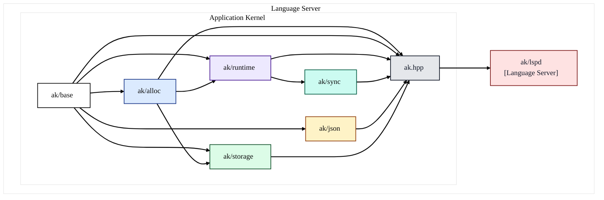

# libak modules overview

This document summarizes how modules in `libak/src/ak` are structured and how they depend on each other.

- **ak/base**: foundational types, error handling, platform bindings (e.g., `liburing`), and small utilities like timers and versioning. Public API: `base_api.hpp` (+ inline in `base_api_inl.hpp`).
- **ak/alloc**: memory allocator primitives built on top of `ak/base`. Public API: `alloc_api.hpp` (+ inline and private headers). Umbrella header `alloc.hpp` aggregates the allocator APIs.
- **ak/runtime**: coroutine-based runtime built on top of `ak/base` and `ak/alloc`, integrates with `io_uring`. Public API: `runtime_api.hpp`, aggregated by `runtime.hpp`.
- **ak/sync**: synchronization primitives that rely on the runtime. Public API: `sync_api.hpp`, aggregated by `sync.hpp`.
- **ak/json**: RFC8259-compliant JSON parser and API using base facilities. Public API: `json_api.hpp`, aggregated by `json.hpp`.
- **ak/storage**: storage utilities (frame table, page cache) that depend on `ak/base` and `ak/alloc`. Public API: `storage_api.hpp`, aggregated by `storage.hpp`.
- **ak/lspd**: example/demo program (“light-speed daemon”) using the high-level umbrella `ak.hpp` and `ak/base`. Not a core library module.

At the root, `ak.hpp` is the umbrella header that includes public APIs of all core modules for convenience.

## Dependency rules (from include graph)

- Base is foundational: no internal module depends beneath it.
- Alloc depends on Base.
- Runtime depends on Base and Alloc.
- Sync depends on Runtime.
- JSON depends on Base.
- Storage depends on Base and Alloc.
- lspd depends on the umbrella `ak.hpp` and Base.

## Dependency diagram

## Notes

- Public headers follow the `*_api.hpp` convention with optional inline headers `*_api_inl.hpp`. Aggregator headers like `alloc.hpp`, `runtime.hpp`, `json.hpp`, `storage.hpp`, and `sync.hpp` re-export their respective public/private APIs for internal use and convenience.
- External dependencies observed: `liburing` and `argtable3` (used in `lspd`).
- JSON implementation is designed to comply with RFC 8259.
