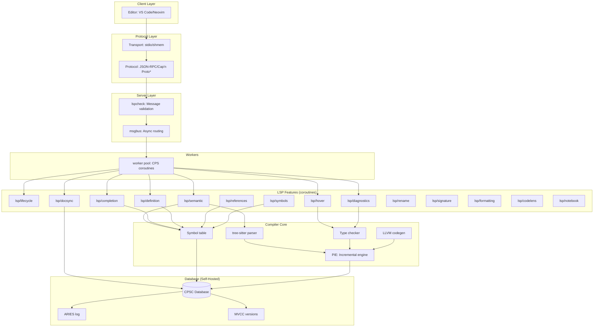

# CPSC: Language-Database Co-Design Research Proposal

## Abstract

We propose **CPSC (Continuation-Passing Style Compiler)**, a research project exploring the co-design of a programming language and database management system. The language is specifically designed to implement high-performance database systems, with coroutines as first-class constructs. The ultimate goal is **dog-fooding**: using CPSC to implement its own compiler infrastructure and a novel transactional database with ARIES logging and MVCC.

**Core Thesis:** Programming languages optimized for specific domains (database systems) can achieve orders-of-magnitude better performance than general-purpose languages, and building that language's tooling in itself validates the design.

---

## 1. Research Motivation

### 1.1 The Language-Database Impedance Mismatch

Modern databases are built in languages (C, C++, Rust) that were not designed for their unique requirements:

**Database System Requirements:**

- **Massive concurrency**: 10,000+ simultaneous transactions
- **Fine-grained checkpointing**: Save/restore state at arbitrary points
- **Zero-copy I/O**: Move data without serialization
- **Deterministic memory**: No unpredictable GC pauses
- **Vectorized execution**: Process similar operations in batches

**Language Mismatches:**

- **Thread-based concurrency**: Expensive (2-8 MB per thread), limits scalability
- **Stack-based execution**: Cannot checkpoint mid-function easily
- **Heap allocation**: Requires complex memory management or GC
- **Lack of integrated persistence**: Serialization is manual and error-prone

### 1.2 Research Questions

1. **Can a language purpose-built for databases outperform general-purpose languages?**
2. **Can coroutines with explicit frame management enable million-transaction systems?**
3. **Can a compiler implement its own infrastructure (dog-fooding) at scale?**
4. **Can LSP-native design enable incremental compilation superior to traditional make/build systems?**

---

## 2. Language Design: CPSC

### 2.1 Core Language Features

#### 2.1.1 Coroutines as Primary Abstraction

**Design:** Everything that does I/O is a coroutine. Standard routines are pure transformations.

```
Coroutine Features:
├── Explicit suspend/resume points
├── Minimal frame size (calculated via liveness analysis)
├── Frame resizing at designated points
├── CPS transformation (continuation-passing style)
├── ghccc calling convention (proven in Haskell/GHC)
└── No stack usage (flat memory model)

Routine Features:
├── Pure functions (no I/O, no malloc)
├── Cannot call coroutines
├── Cannot recurse (iterative only)
├── Standard calling conventions
└── Optimized for CPU-bound work
```

**Rationale:**

- **Scalability**: Coroutine frames can be 64-512 bytes vs 2-8 MB thread stacks
- **Checkpoint-ability**: Suspend points are explicit and controlled
- **Predictability**: No hidden stack growth or recursion
- **Vectorization**: Similar coroutine frames can be batched

#### 2.1.2 Memory Model

**Design:** Multiple memory regions with different semantics:

```
Memory Regions:
├── Stack: Temporary (only between suspend points)
├── Persistent Heap: Database-backed allocations
├── Transient Heap: Request-scoped (arena allocated)
├── Coro Frames: Explicit state storage
└── Tablespaces: Column-oriented frame storage
```

**Key Innovation:** Coroutine frames store **relative pointers only** for transactions.

- Enables moving frames between memory/disk
- Supports million+ concurrent transactions
- Frames become "rows" in temporary tablespace

#### 2.1.3 Type System

**Design:** Distinguish between:

```
Types:
├── Pure types: No side effects
├── IO types: Can suspend (coroutines)
├── Persistent types: Serializable to database
├── Transient types: Request-scoped
└── Linear types: Must be consumed (resource safety)
```

**Compiler enforces:**

- Routines cannot call coroutines
- Persistent types must be trivially serializable
- Linear types prevent resource leaks (file handles, transactions)

#### 2.1.4 Liveness Analysis & Frame Optimization

**Compiler responsibilities:**

1. **Analyze suspend points**: Determine which variables are live
2. **Calculate frame size**: Only store live variables
3. **Optimize layout**: Pack frames efficiently (64-byte cache lines)
4. **Detect resize points**: Where frame can shrink/grow
5. **Generate frame accessors**: Type-safe field access

**Example:**
```
coroutine process_query(db: &Database, query: Query) -> Result {
    // Frame here: {db, query, ...}
    let parsed = parse(query);  // Routine call (pure)
    
    // Suspend point 1: Wait for table lock
    suspend();  // Frame: {db, parsed} (query no longer live)
    
    let rows = execute(parsed, db);  // Large intermediate result
    
    // Shrink frame: rows processed, no longer needed
    resize_frame();  // Frame: {result_summary}
    
    // Suspend point 2: Wait for log flush
    suspend();
    
    return Ok(result_summary);
}
```

### 2.2 Execution Model

#### 2.2.1 Process-per-Core Architecture

**Design:**

- One OS process per CPU core (no migration)
- Each process M:N schedules coroutines
- No OS threads (cooperative scheduling only)
- Shared-nothing architecture (message passing between cores)

**Benefits:**

- Zero context switch overhead (no kernel involvement)
- Perfect CPU cache locality
- No lock contention (lockless per-core data structures)
- Easy to reason about (no preemption)

#### 2.2.2 Vectorized Coroutine Processing

**Key Innovation:** Under load, similar coroutines execute in batches.

**Concept:**

```
1000 transactions arrive with similar structure:
┌─────────────┬─────────────┬─────────────┐
│ Coro Frame  │ Coro Frame  │ Coro Frame  │
│ Field A: 10 │ Field A: 20 │ Field A: 30 │
│ Field B: 5  │ Field B: 7  │ Field B: 9  │
│ ...         │ ...         │ ...         │
└─────────────┴─────────────┴─────────────┘

Columnar layout (automatic under load):
Field A: [10, 20, 30, ...1000 values]  ← Process as SIMD vector
Field B: [5, 7, 9, ...1000 values]     ← Process as SIMD vector
```

**Execution:**
- At suspend: Push frame fields to columnar storage (enqueue)
- At resume: Pop from columns (dequeue)
- Between suspend points: Execute basic block vectorized

**Benefit:** Automatic vectorization for homogeneous workloads (OLTP transactions)

#### 2.2.3 I/O Integration

**Design:** All I/O is async and integrated with coroutine scheduler.

```
I/O Operations (all coroutines):
├── malloc/free: Suspend on OOM, resume when memory available
├── File I/O: io_uring integration (zero-copy)
├── Network: io_uring sockets
├── Database: Async B-tree operations
└── Logging: Async log buffer flush
```

**Key feature:** `malloc` as coroutine enables graceful OOM handling.
- No crashes on out-of-memory
- Transaction can be killed/restarted cheaply
- Memory pressure triggers adaptive behavior

---

## 3. Database Design: Self-Hosted in CPSC

### 3.1 Why Build a Database?

**Dog-fooding strategy:**
1. Build CPSC language (Phase 1)
2. Use CPSC to implement database (Phase 2)
3. Use database to store compiler state (Phase 3)
4. Compiler becomes incremental and persistent (Phase 4)

**Benefits:**
- Validates language design under real workload
- Compiler incrementality drives database features
- Database features drive language features (co-evolution)

### 3.2 Database Features

#### 3.2.1 ARIES Logging

**Purpose:** Crash recovery with transactional guarantees

**Implementation in CPSC:**
```
coroutine log_record(record: LogRecord) {
    // Append to log buffer (in-memory)
    buffer.append(record);
    
    if buffer.is_full() {
        // Suspend: Async flush to disk
        suspend_until_flushed(buffer);
    }
}

coroutine checkpoint() {
    // Suspend: Wait for all dirty pages
    suspend_until_clean();
    
    // Write checkpoint record
    log_record(Checkpoint { lsn: current_lsn() });
}
```

**Why CPSC is ideal:**
- Suspend points match I/O waits naturally
- Transaction = coroutine (kill = abort, cleanup is automatic)
- Frame state = transaction state (checkpointable)

#### 3.2.2 MVCC (Multi-Version Concurrency Control)

**Purpose:** Non-blocking reads, high concurrency

**Implementation strategy:**
```
Versioned Data:
├── Each write creates new version with timestamp
├── Old versions kept until no active transaction needs them
├── Readers never block writers (snapshot isolation)
└── GC reclaims old versions asynchronously (coroutine)

Coroutine integration:
├── Transaction = coroutine with begin timestamp
├── Reads see consistent snapshot
├── Writes create new versions
└── Commit/abort handled by coroutine lifecycle
```

**Why CPSC is ideal:**
- Transaction coroutine carries snapshot timestamp
- Abort = kill coroutine (no explicit cleanup code)
- Million+ concurrent read transactions (tiny frames)

#### 3.2.3 B-Tree Implementation

**Design:** Async B-tree with coroutine-based locking

```
coroutine btree_insert(tree: &BTree, key: Key, value: Value) {
    let node = find_leaf(key);  // May suspend for I/O
    
    // Suspend: Acquire latch
    suspend_until_latched(node);
    
    if node.has_space() {
        node.insert(key, value);
    } else {
        // Suspend: Allocate new page
        let new_page = allocate_page();
        split(node, new_page, key, value);
    }
    
    // Suspend: Log the operation
    log_record(InsertRecord { key, value });
    
    unlatch(node);
}
```

**Why CPSC is ideal:**
- Natural expression of async latch acquisition
- Suspend on I/O (page read/write)
- Transaction isolation via coroutine frames

#### 3.2.4 Query Execution

**Design:** Vectorized query execution using coroutine batching

```
coroutine execute_query(query: Query) {
    let plan = optimize(query);  // Pure function
    
    // Create coroutine per tuple
    for tuple in scan_table() {
        spawn_coro(process_tuple, tuple, plan);
    }
    
    // Under load: Automatic vectorization
    // Similar tuples processed in batch
}
```

**Innovation:** Tuple-at-a-time meets vectorization
- Each tuple = lightweight coroutine
- Scheduler batches similar coroutines automatically
- Best of both worlds (flexibility + performance)

### 3.3 Database as Compiler Backend

**Use case:** Store compiler state in database

```
Compiler Tables:
├── Files: URI, content, version, timestamp
├── AST nodes: Syntax tree storage
├── Symbols: Name, type, location, references
├── Dependencies: File → imports
├── Diagnostics: Errors, warnings
└── Incremental state: PIE computation cache
```

**Benefits:**
- **Incrementality**: Reuse computation from previous compilations
- **History**: Time-travel debugging ("what did the code look like yesterday?")
- **Analysis**: Query symbol usage across entire history
- **Persistence**: Editor restart is instant (no re-parsing)

---

## 4. LSP Frontend: Compiler Interface

### 4.1 LSP-Native Design

**Philosophy:** LSP is not bolted on; it **is** the compiler interface.

Traditional:
```
Compile pipeline: CLI → Files → Compiler → Object files
LSP server: Wrapper around CLI compiler
```

CPSC:
```
Primary interface: LSP → Database → Incremental compiler
Batch mode: Special case (populate DB, request compilation)
```

### 4.2 Architecture



*Cap'n Proto is an **optimization** (Phase 3+), not a requirement. Start with JSON-RPC.

### 4.3 LSP Features (All Coroutines)

Each LSP feature is implemented as a coroutine:

#### `lsp/lifecycle` - Server Lifecycle
- `initialize`: Negotiate capabilities
- `shutdown`, `exit`: Graceful shutdown
- **Priority:** 🔴 Critical (Phase 1)

#### `lsp/docsync` - Document Synchronization
- `textDocument/didOpen`, `didChange`, `didClose`
- Store documents in database (not RAM)
- MVCC enables undo/redo via time-travel
- **Priority:** 🔴 Critical (Phase 1)

#### `lsp/semantic` - Semantic Tokens
- Parse with tree-sitter
- Query symbol table for classifications
- Cache per document version in database
- **Priority:** 🔴 Critical (Phase 2)

#### `lsp/diagnostics` - Error Reporting
- Run parser + type checker (coroutines)
- Store diagnostics in database
- Push to client on change
- **Priority:** 🔴 Critical (Phase 2)

#### `lsp/completion` - Code Completion
- Context analysis (cursor position)
- Query symbols in scope from database
- Rank by relevance
- **Priority:** 🔴 Critical (Phase 2)

#### `lsp/definition` - Go to Definition
- Resolve symbol at position
- Query definition location from database
- **Priority:** 🟠 High (Phase 2)

#### `lsp/hover` - Hover Information
- Resolve symbol
- Query type + documentation
- Format as markdown
- **Priority:** 🟠 High (Phase 2)

#### `lsp/signature` - Signature Help
- Detect function call context
- Query function signatures
- Highlight active parameter
- **Priority:** 🟠 High (Phase 2)

#### `lsp/references` - Find References
- Query symbol references from database
- Efficient with proper indexing
- **Priority:** 🟠 High (Phase 3)

#### `lsp/symbols` - Document/Workspace Symbols
- Extract symbols (functions, types, vars)
- Index in database for fast search
- **Priority:** 🟠 High (Phase 3)

#### `lsp/rename` - Symbol Rename
- Find all references
- Generate workspace edit
- Transactional (all-or-nothing)
- **Priority:** 🟡 Medium (Phase 3)

#### `lsp/formatting` - Code Formatting
- Format based on style rules
- **Priority:** 🟡 Medium (Phase 3)

#### `lsp/codelens` - Code Lens
- Inline commands ("Run test", "N references")
- **Priority:** 🟢 Low (Phase 4)

#### `lsp/notebook` - Notebook Support
- Manage notebook cells
- Cell-level compilation
- **Priority:** 🟢 Low (Phase 4)

---

## 5. Implementation Roadmap

### Phase 1: Bootstrap Compiler (Weeks 1-4)
**Goal:** CPSC compiler that can compile simple programs

**Tasks:**
- ✅ Design coroutine semantics
- ⬜ Implement parser (tree-sitter grammar)
- ⬜ Implement liveness analysis
- ⬜ CPS transformation pass
- ⬜ LLVM codegen (ghccc calling convention)
- ⬜ Basic type checker
- ⬜ Simple runtime (scheduler, malloc)

**Deliverable:** Can compile "Hello World" with coroutines

**Success Metric:**
```cpsc
coroutine main() {
    print("Hello from CPSC!");
    suspend();  // Checkpoint
    print("Resumed!");
}
```

---

### Phase 2: LSP Server (Weeks 5-8)
**Goal:** Basic IDE integration

**Tasks:**
- ⬜ LSP infrastructure (msgbus, worker pool)
- ⬜ `lsp/lifecycle`: initialize/shutdown
- ⬜ `lsp/docsync`: Document sync (in-memory for now)
- ⬜ `lsp/semantic`: Syntax highlighting
- ⬜ `lsp/diagnostics`: Error reporting
- ⬜ `lsp/completion`: Keyword completion
- ⬜ `lsp/hover`: Basic hover
- ⬜ `lsp/definition`: Go to definition

**Deliverable:** VS Code extension for CPSC

**Success Metric:** Useful for writing CPSC code

---

### Phase 3: Self-Hosted Database (Weeks 9-16)
**Goal:** Database implemented in CPSC

**Tasks:**
- ⬜ ARIES logging (write-ahead log)
- ⬜ MVCC transaction manager
- ⬜ B-tree implementation (async)
- ⬜ Buffer pool manager
- ⬜ Query executor (simple)
- ⬜ SQL parser (subset)

**Deliverable:** Working database written in CPSC

**Success Metric:** Pass TPC-C benchmark (simplified)

**Dog-fooding check:** Can CPSC compiler use this database?

---

### Phase 4: Compiler on Database (Weeks 17-20)
**Goal:** Incremental, persistent compilation

**Tasks:**
- ⬜ Store documents in database
- ⬜ Store AST in database
- ⬜ Store symbol table in database
- ⬜ PIE incremental computation framework
- ⬜ Dependency tracking
- ⬜ Cache compilation results

**Deliverable:** Compiler persists across restarts

**Success Metric:**
- Editor restart: instant (no re-parsing)
- Change one line: re-compile only affected code
- Query history: "When was this symbol added?"

---

### Phase 5: Advanced Features (Weeks 21-24)
**Goal:** Production-ready system

**Tasks:**
- ⬜ Vectorized coroutine execution
- ⬜ Frame resizing optimization
- ⬜ Tablespace for transaction frames
- ⬜ Advanced LSP features (references, rename, symbols)
- ⬜ Performance profiling
- ⬜ Documentation generator

**Deliverable:** Production-quality compiler + database

**Success Metric:**
- Compile 100K LOC in < 1 second (incremental)
- Run 10K+ concurrent transactions
- Zero crashes in 24-hour stress test

---

### Phase 6: Cap'n Proto Optimization (Weeks 25+)
**Goal:** Zero-copy LSP communication

**Tasks:**
- ⬜ Generate Cap'n Proto schemas from LSP spec
- ⬜ Shared memory transport (mmap)
- ⬜ TypeScript client bindings
- ⬜ C++ server bindings
- ⬜ Benchmark vs JSON-RPC

**Deliverable:** Optimized LSP protocol

**Success Metric:** 50-90% latency reduction vs JSON-RPC

**Note:** This is optional and only done if JSON-RPC becomes bottleneck.

---

## 6. Module Structure

### 6.1 Repository Layout

```
xinnodb/
├── src/
│   ├── cpscmain/          # Main entry point
│   ├── defs/              # ✅ Common definitions
│   ├── cpsc-types/        # ✅ Type system
│   ├── alloc/             # ✅ Memory allocators
│   ├── task/              # ✅ CPS coroutines
│   ├── ut/                # ✅ Utilities
│   ├── io/                # ✅ I/O operations
│   ├── msgbus/            # Message bus
│   ├── worker/            # Worker pool
│   ├── lspcheck/          # LSP validation
│   │
│   ├── lsp/               # LSP Features (one per folder)
│   │   ├── lifecycle/
│   │   ├── docsync/
│   │   ├── semantic/
│   │   ├── completion/
│   │   ├── definition/
│   │   ├── hover/
│   │   ├── diagnostics/
│   │   ├── signature/
│   │   ├── references/
│   │   ├── symbols/
│   │   ├── rename/
│   │   ├── formatting/
│   │   ├── codelens/
│   │   └── notebook/
│   │
│   ├── parser/            # Tree-sitter integration
│   ├── typeck/            # Type checker
│   ├── codegen/           # LLVM backend
│   ├── incremental/       # PIE framework
│   │
│   └── db/                # Database (self-hosted)
│       ├── aries/         # ARIES logging
│       ├── mvcc/          # MVCC manager
│       ├── btree/         # B-tree
│       ├── buffer/        # Buffer pool
│       ├── query/         # Query executor
│       └── tablespace/    # Frame storage
│
├── tools/
│   └── tree-sitter-cps/   # ✅ CPS grammar
│
└── tests/
    ├── unit/
    ├── integration/
    └── benchmarks/
```

### 6.2 Dependencies

**External:**
- `tree-sitter`: Parser generator
- `LLVM`: Code generation backend
- `fmt`: String formatting (already in use)
- `io_uring`: Async I/O (Linux)

**Optional (Phase 6+):**
- `capnproto`: Zero-copy serialization
- `simdjson`: Fast JSON parser

---

## 7. Success Metrics

### 7.1 Language Metrics
- [ ] Compile 1000 LOC programs
- [ ] Coroutine overhead < 10 cycles per suspend/resume
- [ ] Frame size < 512 bytes (average)
- [ ] Support 100K+ concurrent coroutines per core

### 7.2 Database Metrics
- [ ] ACID compliance (all tests pass)
- [ ] 10K+ TPS (transactions per second)
- [ ] Crash recovery in < 1 second
- [ ] Million+ concurrent read transactions (MVCC)

### 7.3 Compiler Metrics
- [ ] Full compilation: < 100ms per 1K LOC
- [ ] Incremental compilation: < 10ms per change
- [ ] LSP response time: < 50ms (p99)
- [ ] Memory usage: < 100 MB for 10K LOC project

### 7.4 Dog-Fooding Metrics
- [ ] Compiler uses self-hosted database
- [ ] Database implemented in CPSC
- [ ] LSP server implemented in CPSC
- [ ] Zero crashes in continuous operation

---

## 8. Research Contributions

### 8.1 Language Design
**Contribution:** Language optimized for database implementation

**Novel aspects:**
- Coroutines with explicit frame management
- Suspend points as first-class language construct
- Pure routines vs IO coroutines distinction
- Relative pointers for movable frames

### 8.2 Database Architecture
**Contribution:** Database built on coroutines from ground up

**Novel aspects:**
- Transaction = coroutine (abort = kill)
- Vectorized tuple processing via coroutine batching
- Tablespace for transaction frames
- Integrated with language (malloc = coroutine)

### 8.3 Compiler Architecture
**Contribution:** LSP-native incremental compiler

**Novel aspects:**
- LSP as primary interface (not afterthought)
- Database-backed compiler state
- Persistent incrementality across restarts
- Time-travel debugging (historical queries)

### 8.4 Dog-Fooding Validation
**Contribution:** System built in itself validates design

**Validation:**
- Database implemented in CPSC proves language is expressive
- Compiler using database proves database is reliable
- LSP server in CPSC proves coroutines are practical

---

## 9. Risks & Mitigations

| Risk | Mitigation |
|------|------------|
| ghccc calling convention is GHC-specific | LLVM supports it; Haskell proves maintainability; fallback to preserve_most |
| No threads limits parallelism | Process per core; message passing between cores; proven model (Erlang, Go) |
| Coroutine debugging is hard | Custom debugger with suspend point visualization; REPL for interactive testing |
| Database complexity | Start simple (key-value); incremental features; leverage LLVM for codegen |
| LSP scope creep | Focus on critical features first; others are optional |
| Dog-fooding bootstrap problem | Bootstrap compiler in C++; migrate to self-hosted once language is stable |

---

## 10. Timeline Summary

**Total: 24-30 weeks (6-7 months)**

- **Phase 1** (4 weeks): Bootstrap compiler
- **Phase 2** (4 weeks): LSP server
- **Phase 3** (8 weeks): Self-hosted database
- **Phase 4** (4 weeks): Compiler on database
- **Phase 5** (4 weeks): Advanced features
- **Phase 6** (4+ weeks): Optimizations (optional)

**Milestones:**
- Week 4: "Hello World" in CPSC
- Week 8: VS Code extension working
- Week 16: Database passes basic tests
- Week 20: Compiler persists state in database
- Week 24: Production-ready system

---

## Conclusion

CPSC explores the co-design of a language and database system, using the language to implement the database (dog-fooding). The language's coroutine-centric design directly addresses database requirements (massive concurrency, checkpointing, vectorization). By making LSP the primary compiler interface and backing it with a persistent database, we achieve unprecedented incrementality.

**Key Innovation:** Programming language and database evolve together, each driving requirements for the other, validated through self-hosting.
