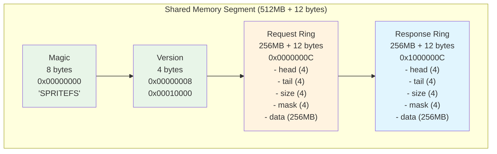
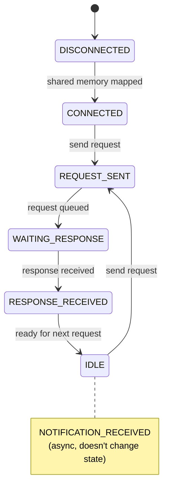
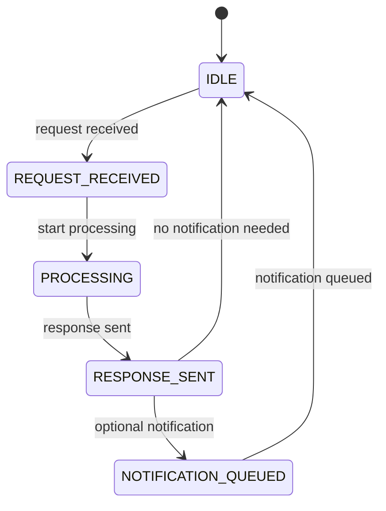

# SpriteFS IPC Protocol Specification

## Inter-Process Communication Protocol

**Version:** 1.4
**Date:** November 17, 2025

---

## Overview

SpriteFS uses a unified shared-memory IPC protocol that serves both VS Code extensions and FUSE mounts. The protocol is designed for zero-copy operations, low latency, and bidirectional communication.

---

## Shared Memory Architecture

### Ring Buffers

Two lock-free shared-memory rings provide the communication backbone:

```c
struct shared_memory_ring {
    uint32_t head;              // Producer position (atomic)
    uint32_t tail;              // Consumer position (atomic)
    uint32_t size;              // Ring size (power of 2)
    uint32_t mask;              // size - 1
    char data[];                // Ring buffer data
};
```

- **Request Ring**: Client → Database (256MB, MPSC - Multiple Producer Single Consumer)
- **Response Ring**: Database → Client (256MB, SPSC - Single Producer Single Consumer)
- **Atomic Synchronization**: Seqlock-based producer-consumer coordination

### Memory Layout



---

## Message Format

### Fixed Header (16 bytes)

```c
struct ipc_header {
    uint32_t seq_id;        // Request ID (>0) or notification (0)
    uint16_t msg_type;      // Operation type
    uint16_t flags;         // Compression, priority, routing flags
    uint64_t payload_len;   // Exact payload length
};
```

**Header Fields:**

- **seq_id**: Unique request identifier (0 for notifications)
- **msg_type**: Operation type (see Message Types section)
- **flags**: Bit flags for compression, priority, routing
- **payload_len**: Payload size in bytes

### Flag Bits

```c
#define FLAG_COMPRESSED     (1 << 0)    // Zstd compressed payload
#define FLAG_HIGH_PRIORITY  (1 << 1)    // High priority processing
#define FLAG_FUSE_MOUNT     (1 << 2)    // FUSE-specific routing
#define FLAG_ENCRYPTED      (1 << 3)    // Encrypted payload
#define FLAG_FRAGMENTED     (1 << 4)    // Message fragmentation
#define FLAG_STREAM_START   (1 << 5)    // Stream operation start
#define FLAG_STREAM_END     (1 << 6)    // Stream operation end
```

---

## Message Types

### History Operations (1-20)

| ID | Name | Direction | Payload | Description |
|----|------|-----------|---------|------------- |
| 1 | COMMIT | Request | commit_payload | Create new commit |
| 2 | TAG_CREATE | Request | tag_payload | Create tag |
| 3 | BRANCH_CREATE | Request | branch_payload | Create branch |
| 4 | BRANCH_UPDATE | Request | branch_update_payload | Update branch ref |
| 5 | REF_DELETE | Request | ref_delete_payload | Delete reference |
| 6 | MERGE | Request | merge_payload | Merge branches |
| 7 | REBASE | Request | rebase_payload | Rebase commits |
| 8 | CHERRY_PICK | Request | cherry_pick_payload | Cherry-pick commit |
| 9 | REVERT | Request | revert_payload | Revert commit |
| 10 | STASH_CREATE | Request | stash_payload | Create stash |
| 11 | STASH_APPLY | Request | stash_apply_payload | Apply stash |

### Forward Operations (21-80)

| ID | Name | Direction | Payload | Description |
|----|------|-----------|---------|------------- |
| 21 | BEGIN_TX | Request | begin_tx_payload | Start transaction |
| 22 | CREATE_OBJECT | Request | create_object_payload | Create blob/tree/symlink |
| 23 | INCREMENTAL_DELTA | Request | incremental_delta_payload | Apply text changes |
| 24 | COMMIT_TX | Request | commit_tx_payload | Commit transaction |
| 25 | CREATE_TREE | Request | create_tree_payload | Create directory |
| 26 | TREE_ADD_ENTRY | Request | tree_add_payload | Add file/dir/symlink |
| 27 | TREE_REMOVE_ENTRY | Request | tree_remove_payload | Remove entry |
| 28 | TREE_RENAME_ENTRY | Request | tree_rename_payload | Rename/move entry |
| 29 | CREATE_SYMLINK | Request | symlink_payload | Create symbolic link |
| 30 | RANGE_LOCK_ACQUIRE | Request | range_lock_payload | Acquire range lock |
| 31 | FULL_BLOB_WRITE | Request | full_blob_payload | Full file write |
| 40 | WATCHER_CREATE | Request | watcher_payload | Create file watcher |
| 41 | WATCHER_DISPOSE | Request | watcher_dispose_payload | Dispose watcher |
| 50 | SUBSCRIBE_STREAM | Request | stream_sub_payload | Subscribe to stream |

### Backward Operations (81-120)

| ID | Name | Direction | Payload | Description |
|----|------|-----------|---------|------------- |
| 81 | UNDO_INCREMENTAL | Request | undo_delta_payload | Undo text changes |
| 82 | COMPENSATION_CLR | Request | clr_payload | ARIES CLR |
| 83 | UNDO_TREE_ADD | Request | undo_tree_add_payload | Undo tree addition |
| 84 | UNDO_TREE_REMOVE | Request | undo_tree_remove_payload | Undo tree removal |
| 85 | UNDO_TREE_RENAME | Request | undo_tree_rename_payload | Undo tree rename |
| 86 | RANGE_LOCK_RELEASE | Request | range_unlock_payload | Release range lock |

### FUSE-Specific Operations (121-160)

| ID | Name | Direction | Payload | Description |
|----|------|-----------|---------|------------- |
| 121 | FUSE_INIT | Request | fuse_init_payload | Mount initialization |
| 122 | FUSE_DESTROY | Request | fuse_destroy_payload | Mount cleanup |
| 123 | FUSE_GETATTR | Request | getattr_payload | Get file attributes |
| 124 | FUSE_LOOKUP | Request | lookup_payload | Path resolution |
| 125 | FUSE_READ | Request | read_payload | File content read |
| 126 | FUSE_WRITE | Request | write_payload | File content write |
| 127 | FUSE_READDIR | Request | readdir_payload | Directory listing |
| 128 | FUSE_MKDIR | Request | mkdir_payload | Create directory |
| 129 | FUSE_RMDIR | Request | rmdir_payload | Remove directory |
| 130 | FUSE_RENAME | Request | rename_payload | Rename/move |
| 131 | FUSE_UNLINK | Request | unlink_payload | Remove file |
| 132 | FUSE_SYMLINK | Request | symlink_payload | Create symlink |
| 133 | FUSE_CHMOD | Request | chmod_payload | Change permissions |
| 134 | FUSE_CHOWN | Request | chown_payload | Change ownership |
| 135 | FUSE_TRUNCATE | Request | truncate_payload | Truncate file |
| 136 | FUSE_FSYNC | Request | fsync_payload | Sync to disk |
| 137 | FUSE_FALLOCATE | Request | fallocate_payload | Allocate space |
| 138 | FUSE_COPY_FILE_RANGE | Request | copy_range_payload | Copy file range |
| 139 | FUSE_XATTR_GET | Request | xattr_get_payload | Get extended attribute |
| 140 | FUSE_XATTR_SET | Request | xattr_set_payload | Set extended attribute |

### Notifications (161-200)

| ID | Name | Direction | Payload | Description |
|----|------|-----------|---------|------------- |
| 161 | FILE_CHANGE_EVENT | Notification | file_change_payload | File system change |
| 162 | TEXT_DOC_CHANGED | Notification | text_change_payload | Document modification |
| 163 | SCM_STATE_CHANGED | Notification | scm_state_payload | SCM state update |
| 164 | WATCHER_EVENT | Notification | watcher_event_payload | Watcher notification |
| 165 | STREAM_CHUNK | Notification | stream_chunk_payload | Stream data chunk |
| 166 | STREAM_END | Notification | stream_end_payload | Stream completion |
| 167 | RANGE_LOCK_CONFLICT | Notification | lock_conflict_payload | Lock conflict |
| 168 | TX_ABORTED | Notification | tx_abort_payload | Transaction abort |
| 169 | RECOVERY_START | Notification | recovery_start_payload | Recovery begin |
| 170 | RECOVERY_COMPLETE | Notification | recovery_complete_payload | Recovery end |

---

## Payload Specifications

### Common Types

```c
struct blake3_hash {
    uint8_t bytes[32];
};

struct var_str {
    uint64_t len;      // VLQ-encoded length
    char data[];       // UTF-8 string data
};

struct person {
    struct var_str name;
    struct var_str email;
    uint64_t timestamp_ns;
};
```

### Request Payloads

#### commit_payload

```c
struct commit_payload {
    uint8_t parent_count;
    struct blake3_hash parents[];    // Variable array
    struct blake3_hash tree_hash;
    struct person author;
    struct person committer;
    struct var_str message;
    uint32_t extra_len;
    uint8_t extra_data[];            // JSON metadata
};
```

#### incremental_delta_payload

```c
struct incremental_delta_payload {
    struct blake3_hash blob_hash;
    struct blake3_hash base_hash;
    uint64_t change_count;           // VLQ-encoded
    struct change_event changes[];   // Variable array
    uint8_t is_snapshot;             // Optional snapshot flag
};

struct change_event {
    uint32_t range_start_line;
    uint32_t range_start_character;
    uint32_t range_end_line;
    uint32_t range_end_character;
    struct var_str text;
};
```

#### tree_add_payload

```c
struct tree_add_payload {
    struct blake3_hash tree_hash;
    struct var_str name;
    uint32_t mode;                   // POSIX mode
    struct blake3_hash object_hash;
};
```

### Response Payloads

#### success_response

```c
struct success_response {
    uint16_t status;                 // 0x0000 = OK
    uint16_t reserved;
    uint64_t payload_len;
    uint8_t payload[];               // Optional: new hash, etc.
};
```

#### error_response

```c
struct error_response {
    uint16_t status;                 // 0x0001 = ERROR
    uint16_t error_code;             // Specific error type
    uint64_t message_len;
    char message[];                  // Error description
};
```

### Notification Payloads

#### file_change_payload

```c
struct file_change_payload {
    uint64_t change_count;           // VLQ-encoded
    struct file_change changes[];    // Variable array
};

struct file_change {
    uint8_t change_type;             // 1=created, 2=changed, 3=deleted
    struct var_str uri;              // File URI/path
};
```

#### stream_chunk_payload

```c
struct stream_chunk_payload {
    uint32_t subscription_id;
    uint64_t chunk_len;
    uint8_t data[];                  // Stream data
};
```

---

## Protocol State Machine

### Client State Machine



### Server State Machine



### Error Handling

- **Timeout**: 30-second default timeout for requests
- **Retry**: Exponential backoff for transient failures
- **Reconnection**: Automatic recovery on connection loss
- **State Sync**: Sequence number validation prevents message loss

---

## Performance Optimizations

### Zero-Copy Operations

- **Shared Memory**: Messages constructed directly in ring buffer
- **Memory Mapping**: File contents served via mmap when possible
- **Batch Operations**: Multiple changes batched in single message

### Compression

- **Algorithm**: Zstd with operation-specific dictionaries
- **Threshold**: Messages >4KB automatically compressed
- **Dictionary Training**: Per-operation type for optimal ratios

### Flow Control

- **Backpressure**: Ring buffer size limits prevent overflow
- **Priority Queues**: High-priority messages processed first
- **Rate Limiting**: Throttling for excessive request rates

---

## Security Considerations

### Authentication

- **Connection Setup**: Repository-specific authentication
- **Message Integrity**: HMAC validation for critical operations
- **Replay Protection**: Sequence number and timestamp validation

### Access Control

- **Operation Authorization**: Path-based permission checking
- **Audit Logging**: All operations logged with actor information
- **Encryption**: Optional TLS tunneling for remote connections

---

## Implementation Notes

### VS Code Integration

```typescript
class SpriteFSIPCClient {
    private requestRing: SharedMemoryRing;
    private responseRing: SharedMemoryRing;
    private seqCounter = 1;

    async sendRequest(type: number, payload: Uint8Array): Promise<IPCResponse> {
        const seqId = this.seqCounter++;
        const header = new IPCHeader(seqId, type, 0, payload.length);

        // Zero-copy enqueue
        await this.requestRing.enqueue(header, payload);

        // Wait for response
        return await this.responseRing.waitForResponse(seqId);
    }
}
```

### FUSE Integration

```c
struct spritefs_fuse_client {
    struct shared_memory_ring *request_ring;
    struct shared_memory_ring *response_ring;
    uint32_t mount_id;
    GHashTable *pending_requests;    // seq_id → fuse_req
};

static int spritefs_fuse_getattr(const char *path, struct stat *stbuf) {
    // Send request, wait for response, populate stat
}
```

### Error Codes

| Code | Name | Description |
|------|------|------------- |
| 0x0000 | SUCCESS | Operation completed successfully |
| 0x0001 | INVALID_REQUEST | Malformed request |
| 0x0002 | PERMISSION_DENIED | Access denied |
| 0x0003 | NOT_FOUND | Object not found |
| 0x0004 | CONFLICT | Operation conflict (locks, etc.) |
| 0x0005 | RESOURCE_EXHAUSTED | Out of memory/disk |
| 0x0006 | TIMEOUT | Operation timed out |
| 0x0007 | CONNECTION_LOST | IPC connection failed |
| 0x0008 | CORRUPTION | Data corruption detected |
| 0x0009 | UNSUPPORTED | Operation not supported |

---

## Future Extensions

### Streaming Operations

- **Large File Transfer**: Chunked upload/download
- **Real-time Sync**: Live collaboration streams
- **Backup/Restore**: Repository streaming

### Advanced Routing

- **Multi-Node**: Distributed database coordination
- **Load Balancing**: Request distribution across instances
- **Caching Layers**: Intermediate cache nodes

### Protocol Evolution

- **Version Negotiation**: Compatible protocol upgrades
- **Feature Flags**: Optional feature detection
- **Custom Messages**: Extensible message type system
