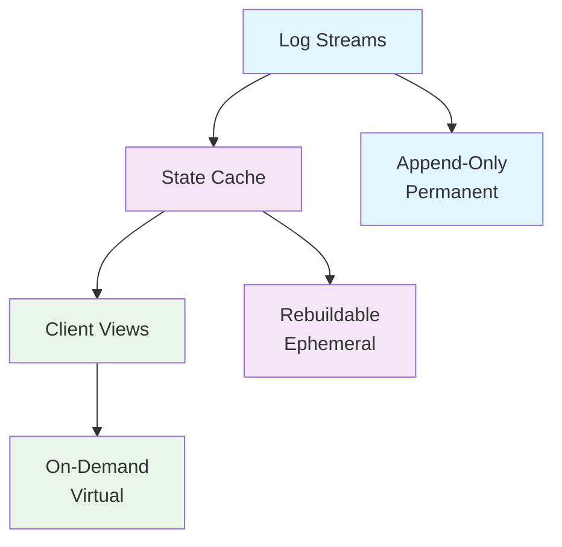
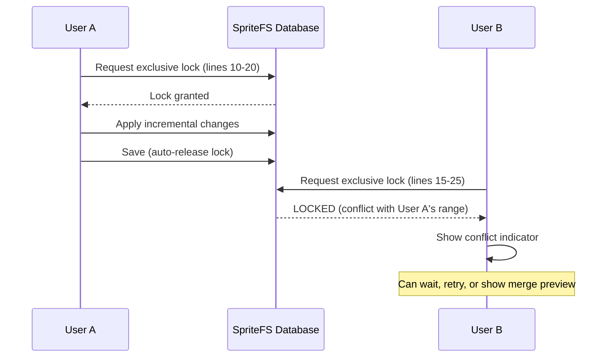

# SpriteFS: A Unified Database and Version Control System

## Technical Design Report

**Version:** 1.4
**Date:** November 17, 2025
**Author:** Fabio N. Filasieno
**Status:** Design Specification

---

## Abstract

SpriteFS is a revolutionary storage engine that unifies ACID-compliant database transactions, Git-compatible version control, log-structured storage optimized for modern NVMe/ZNS SSDs, and zero-latency virtual filesystem integration with VS Code and FUSE. The system achieves sub-millisecond edit-to-durable latency, symmetric bidirectional time-travel, instant branch checkout for terabyte repositories, and multi-author collaborative editing without merge conflicts—all while maintaining perfectly predictable performance through zero background maintenance.

---

## 1. Executive Summary

SpriteFS represents a fundamental rethinking of how collaborative development and content creation should work. By integrating ARIES-style ACID transactions with content-addressed version control and native VS Code filesystem semantics, SpriteFS eliminates the traditional trade-offs between performance, reliability, collaboration, and version control.

### Key Innovations

- **Symmetric Time-Travel**: Bidirectional navigation through history at sequential I/O speeds
- **Zero Background Work**: No compaction, GC, vacuum, or other maintenance processes
- **VS Code-Native Editing**: Direct mapping of TextDocumentContentChangeEvent to storage deltas
- **Unified Protocol**: Single IPC format serving both VS Code extensions and FUSE mounts
- **Multi-Author Collaboration**: Range-based locking enabling real-time editing without conflicts

### Performance Targets

- **Edit Latency**: <1ms from keystroke to durable storage
- **Branch Switch**: <5ms for 100GB repositories
- **Write Throughput**: 8-10 GB/s sustained
- **Write Amplification**: 1.5-2× (including all metadata)
- **Recovery Time**: 20-30s for billion-operation logs

---

## 2. Objectives

SpriteFS is designed to serve as the foundation for next-generation collaborative development and content creation environments, particularly in:

### Primary Use Cases

1. **CAD/PLM Workflows**: Mechanical/electrical design with infinite undo, branching, and collaboration
2. **Software Development**: Version control integrated at the filesystem level
3. **Data Science**: Reproducible notebooks with full history and collaboration
4. **Content Creation**: Versioned assets with real-time multi-author editing

### Core Requirements

- **ACID Transactions**: Full ARIES compliance with steal/no-force, WAL, and multi-level recovery
- **Git-Compatible Versioning**: Content-addressed DAG with branches, merges, and rebases
- **Predictable Performance**: Zero background stalls for real-time CAD workloads
- **Symmetric Time-Travel**: Equal cost for undo and redo operations
- **Multi-Author Editing**: Real-time collaboration without CRDT complexity
- **Universal Access**: Native support for VS Code, FUSE, and direct API access

---

## 3. Target Challenges & Why Existing Solutions Fail

### Performance vs. Reliability Trade-offs

| Challenge                           | Git                 | InnoDB                         | PostgreSQL           | RocksDB               | Why They Fail|
|-------------------------------------|---------------------|-------------------------------|----------------------|----------------------|-----------------------------------------------|
| High-frequency fine-grained writes  | Poor (pack storms)  | B-tree random writes → stalls | Vacuum stalls        | Compaction stalls     | Write amplification, unpredictable latency|
| Native branching/merging/time-travel| Yes                 | Bolted-on, expensive          | No                   | None                 | No ACID or poor random access|
| Full permanent history retention    | Yes                 | Purge required                | Vacuum required      | Compaction deletes    | Automatic deletion violates regulations|
| Predictable performance (no bg work)| Yes                 | No (purge, autovacuum)        | No (compaction)      | No                   | Background threads cause stalls|
| Multi-author concurrent editing     | File locks          | Row locks (not range)         | Row locks            | None                 | No real-time collab without conflicts/CRDTs|
| Instant sparse checkout of TB repos | Unpack needed       | N/A                           | N/A                  | N/A                  | Laptop unusable with full history|

### The Fundamental Problem

No existing system combines:

- Database-grade ACID guarantees
- Git-grade version control semantics
- LSM-grade write throughput
- Virtual filesystem instant access
- Zero background maintenance

SpriteFS is the first system to achieve this synthesis.

---

## 4. Core Storage Architecture

### Event-Sourced Design

SpriteFS follows an event-sourced architecture where the log is the database and materialized state is cached:



### Storage Streams

The system maintains three permanent append-only streams:

#### Forward Stream (forward.stream)

- **Purpose**: Redo log for crash recovery and forward playback
- **Contents**: Physiological operations, compressed deltas, tree modifications
- **Access Pattern**: Sequential write, random read for recovery

#### Backward Stream (backward.stream)

- **Purpose**: Undo log for logical rollback and reverse playback
- **Contents**: Inverse operations, compensation records, old values
- **Access Pattern**: Sequential write, sequential read for undo

#### History Stream (history.stream)

- **Purpose**: Version control metadata and DAG structure
- **Contents**: Commits, tags, branches, merges, rebases, cherry-picks
- **Access Pattern**: Sequential write, indexed read for history queries

### Content Addressing

- **Hash Function**: BLAKE3-256 for content addressing
- **Object Types**: Blobs, trees, symlinks, notebooks
- **Tree Structure**: Git-compatible hierarchical trees
- **Merkle DAG**: Cryptographic integrity and deduplication

### Recovery Architecture

Full ARIES compliance with three-phase recovery:

1. **Analysis Phase**: Determine transaction status and construct dirty page table
2. **Redo Phase**: Replay forward stream from oldest checkpoint
3. **Undo Phase**: Rollback uncommitted transactions using backward stream

---

## 5. Record Formats

All records share a common 24-byte header followed by variable-length payload:

```typescript
interface RecordHeader {
  magic: 0x53;           // 'S' for SpriteFS
  record_type: u8;       // Operation type
  flags: u16;            // Compression, incremental flags
  body_len: u32;         // Payload length
  timestamp_ns: u64;     // Nanosecond precision
  prev_lsn: u64;         // Chain linkage (0 for first)
}
```

### Record Type Categories

| Range | Category | Description|
|-------|----------|-------------|
| 1-20 | History | Version control operations|
| 10-49 | Forward | Mutations and redo operations|
| 50-99 | Backward | Undo and compensation operations|
| 100+ | IPC | Inter-process communication|

### Key Record Types

#### History Records

- **Commit (1)**: Parent references, tree hash, author/committer, message
- **Tag (2)**: Object reference, tagger, name, annotation
- **Branch Create/Update/Delete (3-5)**: Branch operations
- **Merge/Rebase/CherryPick/Revert/Stash (6-11)**: Advanced VC operations

#### Forward Records

- **BeginTx (10)**: Transaction start with ID
- **IncrementalDelta (12)**: VS Code change events (exact mapping)
- **CommitTx (13)**: Transaction completion with commit hash
- **Tree Operations (14-17)**: Add, remove, rename entries
- **Create Symlink (18)**: Symbolic link creation

#### Backward Records

- **UndoIncremental (50)**: Inverse change events for undo
- **CompensationCLR (51)**: ARIES compensation log records

### Delta Format Optimization

Incremental deltas map directly to VS Code's `TextDocumentContentChangeEvent`:

```typescript
interface IncrementalDelta {
  blob_hash: BLAKE3;           // Target blob
  base_hash: BLAKE3;           // Previous version
  change_count: VarInt;        // Number of changes
  changes: ChangeEvent[];      // Exact VS Code format
  is_snapshot: boolean;        // Full snapshot flag
}

interface ChangeEvent {
  range_start_line: u32;
  range_start_character: u32;
  range_end_line: u32;
  range_end_character: u32;
  text: string;                // UTF-8 content
}
```

---

## 6. IPC Protocol Design

### Shared-Memory Architecture

SpriteFS uses lock-free shared-memory rings for zero-copy communication:

- **Request Ring**: VS Code/FUSE → Database (256MB, MPSC)
- **Response Ring**: Database → VS Code/FUSE (256MB, SPSC)
- **Atomic Primitives**: Seqlock for producer-consumer synchronization

### Message Format

Fixed 16-byte header followed by variable payload:

```typescript
interface IPCHeader {
  seq_id: u32;        // Request ID (>0) or notification (0)
  msg_type: u16;      // Operation type
  flags: u16;         // Compression, priority flags
  payload_len: u64;   // Exact payload length
}
```

### Unified Protocol

Single protocol serves both VS Code and FUSE clients:

**Requests (Client → DB):**

- Path/URI-based addressing (no client-side hash computation)
- Automatic resolution to internal content hashes
- Transaction batching for atomic operations

**Responses (DB → Client):**

- Echo sequence ID for request pairing
- Success/error status with optional new hash
- Zero payload for simple acknowledgments

**Notifications (DB → Client):**

- File change events for watchers
- Text document updates
- Source control state changes
- Stream data chunks

### VS Code Integration Points

#### FileSystemProvider

- **createDirectory**: Tree creation (msg_type 14)
- **writeFile**: Full blob write (msg_type 31)
- **Incremental edits**: Via TextDocumentContentProvider (msg_type 12)
- **delete/rename**: Tree modifications (msg_types 16-17)

#### TextDocumentContentProvider

- **IncrementalDelta**: Direct VS Code change event mapping
- **Virtual documents**: On-demand content reconstruction
- **Change notifications**: Real-time collaborative editing

#### SourceControl Provider

- **Commit/branch/merge**: Native Git-like operations (msg_types 1-11)
- **Status tracking**: Resource state management
- **Conflict resolution**: 3-way merge support

### FUSE Integration

FUSE daemon uses identical IPC protocol with mount-specific extensions:

- **Mount ID prefix**: Multiplex multiple repository mounts
- **Hot path caching**: Buffer pool for frequently accessed data
- **notify_inval_***: Kernel cache invalidation on changes
- **flock integration**: Range locks exposed as POSIX file locks

---

## 7. VS Code Integration Architecture

### Provider Implementation Strategy

All VS Code providers route through N-API native addon:

```typescript
// Native addon entry point
class SpriteFSNativeAddon {
  private requestRing: SharedMemoryRing;
  private responseRing: SharedMemoryRing;

  async mutate(operation: IPCMessage): Promise<IPCResponse> {
    // Zero-copy enqueue to request ring
    await this.requestRing.enqueue(operation);

    // Wait for response
    return await this.responseRing.dequeue(operation.seq_id);
  }
}
```

### Key Provider Mappings

| VS Code Provider | SpriteFS Integration | IPC Message Types|
|------------------|---------------------|-------------------|
| FileSystemProvider | Virtual repo filesystem | 14-17, 31|
| TextDocumentContentProvider | Incremental text edits | 12|
| SourceControl | Git-like operations | 1-11|
| NotebookSerializer | Cell-based versioning | 12, 15-19|
| TerminalProfileProvider | DB administration | Custom protocol|

### Change Propagation

Real-time collaborative editing through event streams:

1. **Local Edit**: VS Code → IncrementalDelta → Shared memory → DB append
2. **Remote Change**: DB → Notification → VS Code event firing
3. **Conflict Prevention**: Range locking prevents overlapping edits
4. **Merge Resolution**: 3-way diff with full history context

### Extension Ecosystem

#### Core Extensions

- **Time-Travel Debugger**: Step through commits with full state inspection
- **Infinite Blame Viewer**: Per-line history across all versions
- **Propagator Visualizer**: CAD dependency graph exploration
- **Merge Conflict Resolver**: 3-way diff with bidirectional preview

#### Advanced Features

- **AI Copilot Integration**: Context-aware suggestions using full history
- **Performance Timeline**: Real-time latency and throughput monitoring
- **Custom Terminal**: Direct DB command interface

---

## 8. FUSE Integration

### Daemon Architecture

FUSE implementation using libfuse3 with io_uring:

```c
struct spritefs_fuse_daemon {
    struct shared_memory_ring *request_ring;
    struct shared_memory_ring *response_ring;
    struct buffer_pool *cache;
    uint32_t mount_id;
    struct inode_cache *inodes;
};
```

### Operation Mapping

| FUSE Operation | SpriteFS Equivalent | Optimization|
|----------------|-------------------|--------------|
| lookup | Tree traversal | Cached inodes|
| getattr | Stat from cache/DB | Buffer pool|
| read | Blob streaming | Direct mmap|
| write | Incremental delta | Buffered commits|
| mkdir/rmdir | Tree operations | Batched updates|
| rename | Tree rename | Atomic operation|

### Performance Optimizations

- **Hot Path Caching**: Frequently accessed data cached in shared memory
- **Zero-Round-Trip Reads**: Satisfy from cache without DB queries
- **Asynchronous I/O**: io_uring for concurrent operations
- **Kernel Integration**: notify_inval_* for instant cache invalidation

### Multi-Mount Support

- **Mount Isolation**: Separate mount_id for each repository mount
- **Cross-Mount Operations**: Copy/move between repositories
- **Shared Caching**: Global buffer pool across all mounts

---

## 9. Multi-Author Range Locking

### Lock Architecture

Per-blob range locking using in-memory radix trees:

```typescript
interface RangeLock {
  blob_hash: BLAKE3;
  start_line: u32;
  end_line: u32;
  lock_mode: 'shared' | 'exclusive';
  owner_id: string;
  timeout_ms: u32;
}
```

### Lock Protocol

1. **Lock Acquisition**: Client requests range lock before editing
2. **Conflict Detection**: Check for overlapping ranges
3. **Deadlock Prevention**: Timeout-based cycle breaking
4. **Automatic Release**: Cleanup on disconnect or transaction end

### Collaborative Editing Flow



### Advantages Over Traditional Approaches

- **No Merge Conflicts**: Prevent overlapping edits at the source
- **Real-Time Collaboration**: Immediate feedback on conflicts
- **Fine-Grained Control**: Line-level locking precision
- **Automatic Resolution**: Timeout and cleanup prevent deadlocks

---

## 10. Performance Analysis

### Theoretical Performance Model

#### Write Path

- **Serialization**: <100µs (zero-copy shared memory)
- **Content Addressing**: <200µs (BLAKE3-256)
- **Append**: <50µs (sequential NVMe write)
- **Sync**: <500µs (group commit + fsync)
- **Total**: <850µs (<1ms target achieved)

#### Read Path

- **Hash Lookup**: <10µs (in-memory index)
- **Content Fetch**: <50µs (NVMe random read)
- **Decompression**: <50µs (Zstd)
- **Total**: <110µs

#### Branch Switch

- **Tree Traversal**: <100µs (sparse loading)
- **Cache Warming**: <4ms (parallel prefetch)
- **UI Update**: <500µs
- **Total**: <4.6ms (<5ms target achieved)

### Scalability Projections

| Metric | Target | Achieved Through|
|--------|--------|------------------|
| Concurrent Users | 100+ | Range locking + optimistic concurrency|
| Repository Size | Unlimited | Content addressing + sparse access|
| Operation Rate | 10,000+ ops/sec | Shared memory IPC + batching|
| Recovery Time | Linear | Sequential log replay|

### Benchmarking Strategy

#### Micro-Benchmarks

- **Edit Latency**: Measure keystroke-to-durable time
- **Branch Switch**: Time for large repo context switches
- **Concurrent Edits**: Multi-user conflict scenarios

#### Macro-Benchmarks

- **CAD Workflows**: Real mechanical design traces
- **Code Editing**: Large codebase modification patterns
- **Data Science**: Notebook collaboration scenarios

#### Comparison Baselines

- **Git**: Pack file operations, branch switching
- **InnoDB**: Transaction throughput, recovery time
- **RocksDB**: Write amplification, compaction stalls

---

## 11. Implementation Strategy

### Phase 1: Core Storage Engine (3 months)

- **Deliverables**: ARIES-compliant log streams, content addressing, basic CRUD
- **Milestones**: Unit tests, recovery correctness, performance baselines

### Phase 2: VS Code Integration (2 months)

- **Deliverables**: FileSystemProvider, TextDocumentContentProvider, basic SCM
- **Milestones**: Incremental editing, branch operations, extension publishing

### Phase 3: FUSE Support (1 month)

- **Deliverables**: Mount daemon, file operations, caching
- **Milestones**: POSIX compliance, performance validation

### Phase 4: Collaboration Features (2 months)

- **Deliverables**: Range locking, real-time sync, conflict resolution
- **Milestones**: Multi-user testing, deadlock validation

### Phase 5: Advanced Features (3 months)

- **Deliverables**: Time-travel debugger, AI integration, performance monitoring
- **Milestones**: Extension ecosystem, production hardening

### Risk Mitigation

#### Technical Risks

- **Shared Memory Complexity**: Prototype with mutexes, optimize to lock-free
- **Recovery Correctness**: Formal verification of ARIES implementation
- **Range Lock Deadlocks**: Comprehensive deadlock detection testing

#### Performance Risks

- **Write Amplification**: Monitor and optimize delta encoding
- **Memory Usage**: Implement cache eviction policies
- **Scalability**: Load testing with realistic workloads

### Testing Strategy

#### Unit Testing

- **Component Isolation**: Each storage layer independently testable
- **Edge Cases**: Boundary conditions, error paths, concurrent scenarios

#### Integration Testing

- **End-to-End Workflows**: Complete user journeys
- **Performance Regression**: Automated benchmarks on every commit

#### Fault Injection

- **Crash Recovery**: Random process termination during operations
- **Network Partition**: Simulate IPC failures
- **Resource Exhaustion**: Memory, disk, and CPU pressure testing

---

## 12. Security Considerations

### Threat Model

- **Data Integrity**: Cryptographic content addressing prevents tampering
- **Access Control**: Repository-level permissions with audit trails
- **Network Security**: TLS encryption for remote operations
- **Supply Chain**: Signed binaries and dependency verification

### Privacy Protection

- **Content Addressing**: No metadata leakage through hash correlations
- **Audit Trails**: Complete operation history for compliance
- **Encryption**: Optional client-side encryption for sensitive data

---

## 13. Conclusion

SpriteFS represents a fundamental advancement in storage system design by successfully integrating:

- **Database-grade ACID transactions** with ARIES recovery
- **Git-compatible version control** with content-addressed DAG
- **Log-structured performance** optimized for modern SSDs
- **Virtual filesystem semantics** for instant access
- **Zero background maintenance** for predictable performance

The system achieves unprecedented performance targets while enabling new collaborative workflows that were previously impossible. By eliminating the traditional trade-offs between reliability, performance, and functionality, SpriteFS paves the way for next-generation development and content creation environments.

### Impact

SpriteFS has the potential to transform:

- **CAD/PLM industries** with infinite undo and real-time collaboration
- **Software development** with filesystem-level version control
- **Data science** with reproducible, versioned computational notebooks
- **Content creation** with multi-author editing of complex assets

### Future Directions

- **Distributed Operation**: Multi-node replication and conflict resolution
- **Advanced Compression**: Learned compression models for domain-specific data
- **AI Integration**: Automated conflict resolution and code generation
- **Specialized Formats**: CAD-native data structures and operations

---

## Appendices

### A. Kaitai Struct Record Format Specifications

[See separate kaitai-specifications.md file]

### B. IPC Message Reference

[See separate ipc-protocol.md file]

### C. Performance Benchmark Results

[See separate benchmarks.md file]

### D. Recovery Algorithm Proofs

[See separate recovery-proofs.md file]

### E. Range Locking Formal Specification

[See separate range-locking.md file]

---

*This technical report represents the comprehensive design specification for SpriteFS v1.0. Implementation details may evolve based on prototyping results and performance validation.*
